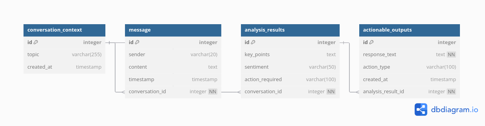

# Backend - AI Engineer technical challenge

---

## System instructions

- Download the project in the desired folder
- Create the .env in the root folder with the OPEN_AI_KEY on it.

```
echo OPEN_AI_KEY="key..." > .env
```

Run the commands below:

```
docker build -t backend_ai_engineer_erikson .

docker run --env-file .env -p 8000:8000 backend_ai_engineer_erikson
```

The url of API in the local is:
http://127.0.0.1:8000/api/process_message

---

## System Information

## Folder Structure

    |-- .venv
    |-- src
    |   |-- app
    |   |   |-- api
    |   |   |   |-- routes.py
    |   |   |-- data
    |   |   |   |-- knowledge_base.txt
    |   |   |-- eval
    |   |   |   |-- evaluator.py
    |   |   |   |-- golden_dataset.json
    |   |   |-- llm
    |   |   |   |-- llm_handler.py
    |   |   |-- models
    |   |   |   |-- actionable_output_model.py
    |   |   |   |-- analysis_result_model.py
    |   |   |   |-- conversation_context_model.py
    |   |   |   |-- message_model.py
    |   |   |   |-- process_message_request_model.py
    |   |   |   |-- process_message_response_model.py
    |   |   |-- services
    |   |   |   |-- conversation_manager_service.py
    |   |   |   |-- message_service.py
    |   |   |-- tests
    |   |   |   |-- app
    |   |   |   |   |-- services
    |   |   |   |   |   |-- test_message_service.py
    |   |   |   |   |-- tools
    |   |   |   |   |   |-- test_crm_tool.py
    |   |   |-- tools
    |   |   |   |-- crm_tool.py
    |   |   |   |-- rag_tool.py
    |   |   |   |-- run_evaluation.py
    |   |-- assets
    |   |   |-- images
    |   |   |   |-- DBStructure_backendAIEngeneerTechChallenge_Erikson.png
    |   |-- config
    |   |   |-- config.py
    |   |-- instance (provisory)
    |   |   |-- tech_challenge.db
    |   |-- utils
    |   |   |-- http_responses.py
    |   |-- main.py
    |   |-- run.py
    |-- .env
    |-- .gitignore
    |-- Dockerfile
    |-- README.md
    |-- requirements.txt

---

# Deployment and Scalability Notes

- Containerize using Docker with a Dockerfile defining environment and dependencies.
- Deploy on Kubernetes for scalability and resilience; use Horizontal Pod Autoscaling (HPA) to handle varying load.
- Use a managed vector database service or persist FAISS indices to disk for stateful storage.
- Include logging and monitoring (e.g., Prometheus + Grafana) to track KPIs like latency, errors, confidence scores.
- Secure endpoints with API authentication (e.g., API keys, OAuth).
- Cache frequent CRM queries and knowledge base results to reduce LLM latency.


---

## Database Structure for former SQL (Not implemented)

### Migration
````
example:

    alembic revision --autogenerate -m "commit information"
    alembic upgrade head
````

    // AI Sales Agent Contextual Database
    // DBML version
    
    Table conversation_context {
      id integer [primary key]
      topic varchar(255)
      created_at timestamp
    }
    
    Table message {
      id integer [primary key]
      sender varchar(20)
      content text
      timestamp timestamp
      conversation_id integer [not null]
    }
    
    Table analysis_results {
      id integer [primary key]
      key_points text
      sentiment varchar(50)
      action_required varchar(100)
      conversation_id integer [not null]
    }
    
    Table actionable_outputs {
      id integer [primary key]
      response_text text [not null]
      action_type varchar(100)
      created_at timestamp
      analysis_result_id integer [not null]
    }
    
    // Relationships
    Ref: message.conversation_id > conversation_context.id
    Ref: analysis_results.conversation_id > conversation_context.id
    Ref: actionable_outputs.analysis_result_id > analysis_results.id

### Visual context of database structure

